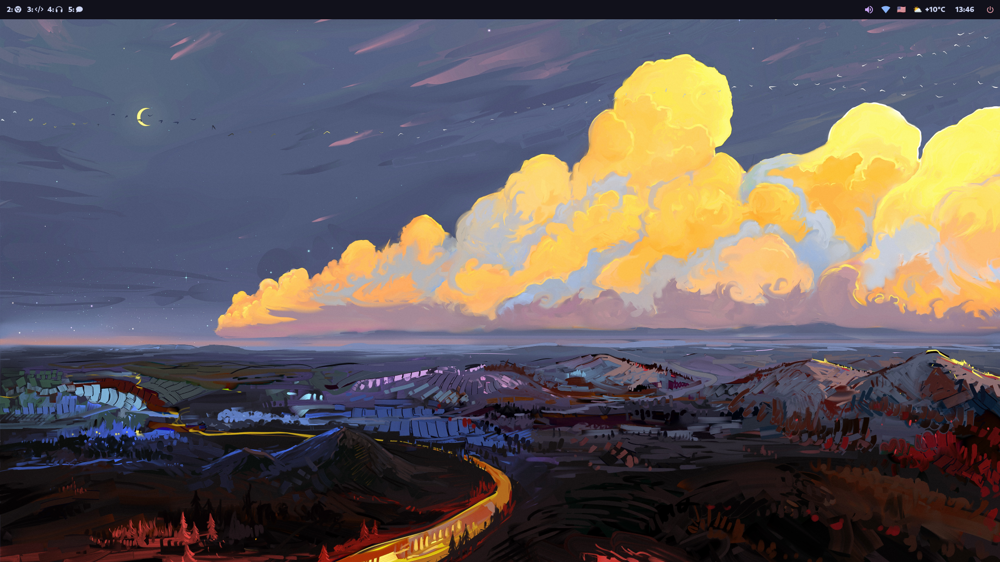

<h1 align="center">martinzane/dotfiles</h1>

These are my dotfiles for Debian.

This is a minimalist, terminal-driven setup, focused on speed and efficiency.

An installation script is planned for the future. In the meantime, the [manual installation guide](/docs/installation.md) is available.

## Software Overview

This is a quick overview of the main software used in this setup.

The complete list can be found [docs/software.md](/docs/software.md).

| Component | Software |
| -------- | ------- |
| Operating system | [Debian](https://www.debian.org/) |
| Window manager | [Sway](https://swaywm.org/) |
| Status bar | [Waybar](https://github.com/Alexays/Waybar) |
| Terminal | [foot](https://codeberg.org/dnkl/foot) |
| Shell | [zsh](https://wiki.debian.org/Zsh) |
| Notifications | [dunst](https://github.com/dunst-project/dunst) |
| Screenshots | [grim](https://sr.ht/~emersion/grim/) and [slurp](https://github.com/emersion/slurp) |
| Launcher | [Tofi](https://github.com/philj56/tofi) |
| File manager | [lf](https://github.com/gokcehan/lf) |
| Image viewer | [imv](https://sr.ht/~exec64/imv/) |
| Audio player | [ncmpcpp](https://github.com/ncmpcpp/ncmpcpp) |
| Video player | [mpv](https://mpv.io/) |
| Browser | [Brave](https://brave.com/) |
| Text Editor | [VSCodium](https://vscodium.com/) |
| Color scheme | [Catppuccin](https://catppuccin.com/) |